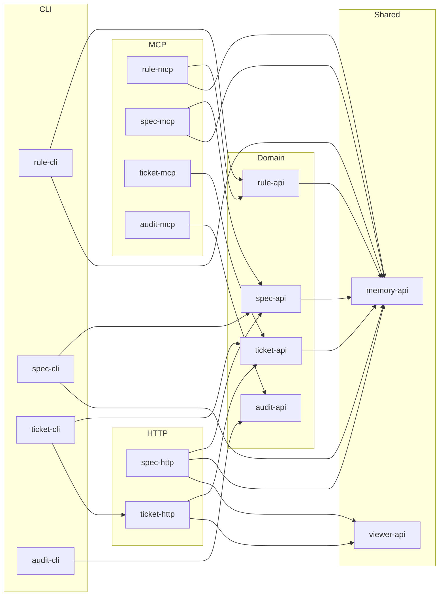

## Dependency Graph

```mermaid
flowchart LR
    subgraph Shared
        Memory[memory-api]
        Viewer[viewer-api]
    end

    subgraph Domain
        Rule[rule-api]
        Spec[spec-api]
        Ticket[ticket-api]
        Audit[audit-api]
    end

    subgraph CLI
        RuleCli[rule-cli]
        SpecCli[spec-cli]
        TicketCli[ticket-cli]
        AuditCli[audit-cli]
    end

    subgraph MCP
        RuleMcp[rule-mcp]
        SpecMcp[spec-mcp]
        TicketMcp[ticket-mcp]
        AuditMcp[audit-mcp]
    end

    subgraph HTTP
        SpecHttp[spec-http]
        TicketHttp[ticket-http]
    end

    Rule --> Memory
    Spec --> Memory
    Ticket --> Memory

    RuleCli --> Rule
    RuleCli --> Memory
    SpecCli --> Spec
    SpecCli --> Memory
    TicketCli --> Ticket
    TicketCli --> TicketHttp
    AuditCli --> Audit

    RuleMcp --> Rule
    RuleMcp --> Memory
    SpecMcp --> Spec
    SpecMcp --> Memory
    TicketMcp --> Ticket
    AuditMcp --> Audit

    SpecHttp --> Spec
    SpecHttp --> Memory
    SpecHttp --> Viewer
    TicketHttp --> Ticket
    TicketHttp --> Viewer
```
