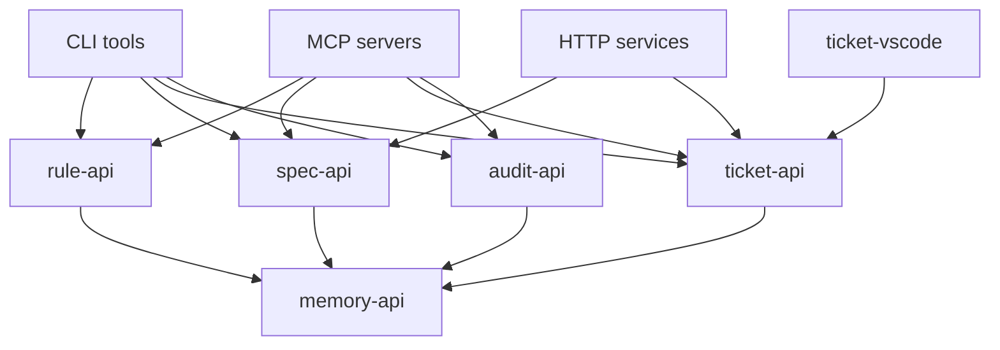

## Dependency Graph

```mermaid
flowchart TB
    Memory[memory-api]
    Rule[rule-api]
    Spec[spec-api]
    Ticket[ticket-api]
    Audit[audit-api]
    CLI[CLI tools]
    MCP[MCP servers]
    HTTP[HTTP services]
    VSCode[ticket-vscode]

    Rule --> Memory
    Spec --> Memory
    Ticket --> Memory
    Audit --> Memory
    CLI --> Rule
    CLI --> Spec
    CLI --> Ticket
    CLI --> Audit
    MCP --> Rule
    MCP --> Spec
    MCP --> Ticket
    MCP --> Audit
    HTTP --> Spec
    HTTP --> Ticket
    VSCode --> Ticket
```
