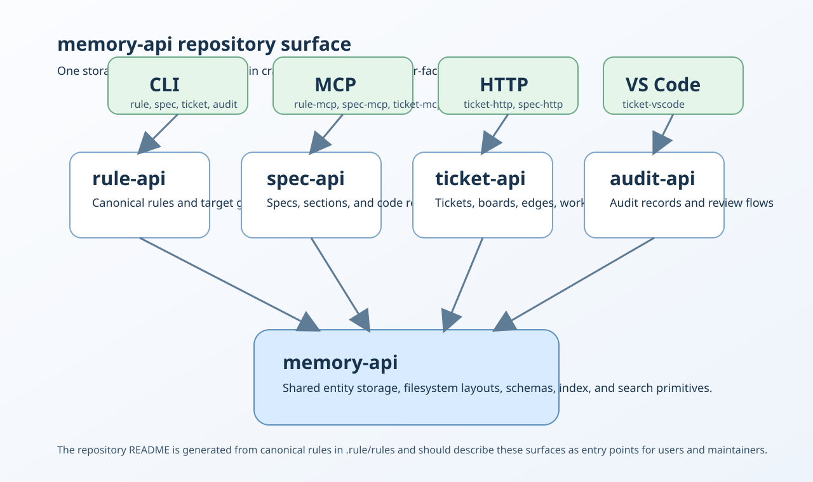
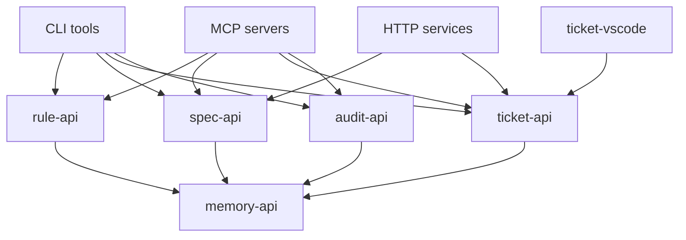

<!-- rule-api:file generated=true -->

<!-- rule-api:entry id=eaa176c7-4d98-4f0f-aea6-97ab1a2f72a4 slug=memory-api/readme/memory-api/l1 -->
# memory-api

memory-api is the repository that exposes the core crates and operator surfaces behind rules, specs, tickets, and audits.

## Tool Surface

| Crate or surface | What it is used for | Typical entry points |
| --- | --- | --- |
| `memory-api` | Generic filesystem-backed entity storage, schema validation, SQLite indexing, search, edge management, and board coordination. | Reused by the other crates in this repo. |
| `rule-api` | Canonical rule manifests, markdown import, target composition, and nested workspace discovery. | `rule-cli`, `rule-mcp` |
| `spec-api` | Specification manifests, sections, slugs, code references, and validation rules. | `spec-cli`, `spec-mcp`, `spec-http` |
| `ticket-api` | Ticket domain logic, workspace state, board snapshots, execution contracts, watchers, and reconciliation. | `ticket-cli`, `ticket-mcp`, `ticket-http`, `ticket-vscode` |
| `audit-api` | Repository quality audits, indexes, summaries, and review-oriented validation flows. | `audit-cli`, `audit-mcp` |

<!-- rule-api:entry id=7bc8b184-2c17-4c90-a616-0a1e1d066cee slug=memory-api/readme/memory-api/user-stories/l5 -->
## Tool Screenshots

The current repository visual below summarizes the main memory-api tool and crate surfaces.



<!-- rule-api:entry id=4a232bc0-bd5c-4930-b005-e939669f90d2 slug=memory-api/readme/memory-api/usage-guide/l11 -->
## Dependency Graph



<!-- rule-api:entry id=84278ede-0aaa-4382-83db-e6ee5d80106c slug=memory-api/readme/memory-api/crate-groups/l18 -->
## Tool Use Examples

```bash
cargo run -p rule-cli -- sync-targets --config memory-viewers/memory-api/rule-targets.yaml
cargo run -p ticket-cli -- board show
cargo run -p spec-cli -- refs <spec-id> validate
cargo run -p audit-cli -- help
```

- Regenerate the repo README from canonical rule content managed by `rule-api`.
- Inspect active board state through the `ticket-api` command surface.
- Validate a specification's code references through `spec-api` tooling.
- Discover the available review and audit flows exposed by `audit-api`.
