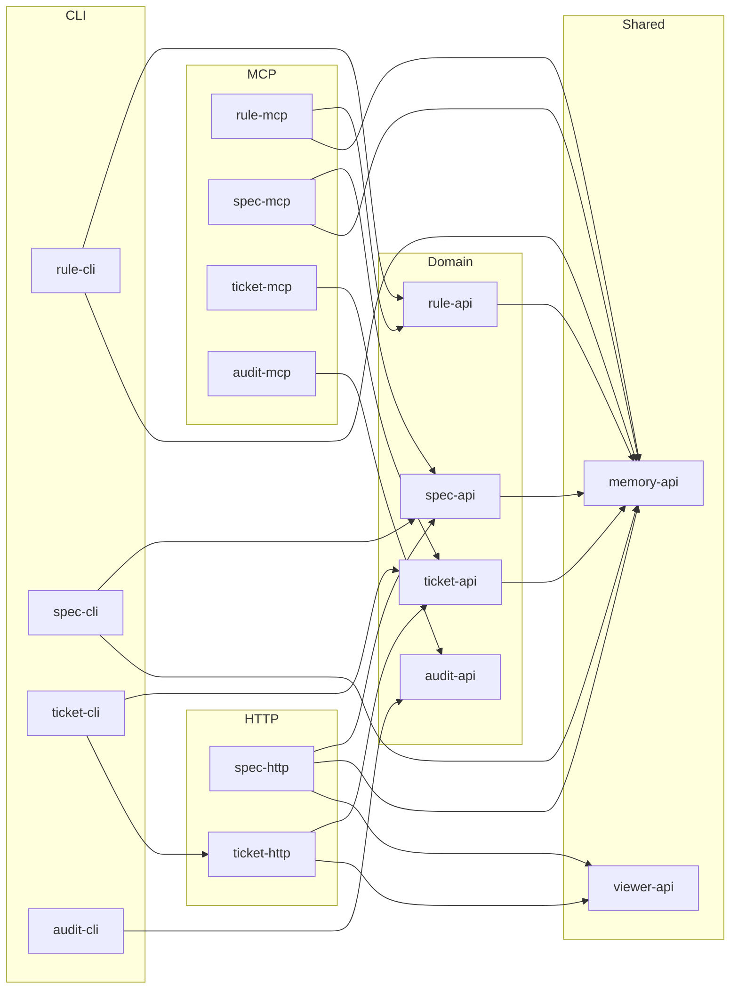

<!-- rule-api:file generated=true -->

<!-- rule-api:entry id=eaa176c7-4d98-4f0f-aea6-97ab1a2f72a4 slug=memory-api/readme/memory-api/l1 -->
# memory-api

memory-api is the repository that exposes the core crates and operator surfaces behind rules, specs, tickets, and audits.

## Tool Surface

| Crate or surface | What it is used for | Typical entry points |
| --- | --- | --- |
| `memory-api` | Generic filesystem-backed entity storage, schema validation, SQLite indexing, search, edge management, and board coordination. | Reused by the other crates in this repo. |
| `rule-api` | Canonical rule manifests, markdown import, target composition, and nested workspace discovery. | `rule`, `rule-mcp` |
| `spec-api` | Specification manifests, sections, slugs, code references, and validation rules. | `spec`, `spec-mcp`, `spec-http` |
| `ticket-api` | Ticket domain logic, workspace state, board snapshots, execution contracts, watchers, and reconciliation. | `ticket`, `ticket-mcp`, `ticket-http`, `ticket-vscode` |
| `audit-api` | Repository quality audits, indexes, summaries, and review-oriented validation flows. | `audit`, `audit-mcp` |

<!-- rule-api:entry id=4a232bc0-bd5c-4930-b005-e939669f90d2 slug=memory-api/readme/memory-api/usage-guide/l11 -->
## Dependency Graph



<!-- rule-api:entry id=84278ede-0aaa-4382-83db-e6ee5d80106c slug=memory-api/readme/memory-api/crate-groups/l18 -->
## Tool Use Examples

### Install the CLI tools

From the `context-engine` repo root, the shared installer can run the same four Cargo installs for you:

```bash
bash ./install-tools.sh --tool rule-cli --tool spec-cli --tool ticket-cli --tool audit-cli
```

If you are working directly from a `memory-viewers/memory-api` checkout instead of the repo root, run the underlying install commands from this workspace:

```bash
cargo install --path tools/cli/rule-cli --bin rule
cargo install --path tools/cli/spec-cli --bin spec
cargo install --path tools/cli/ticket-cli --bin ticket
cargo install --path tools/cli/audit-cli --bin audit
```

After that, verify the install with `rule --help`, `spec --help`, `ticket --help`, and `audit --help`.

### Set up a workspace repository

From the repository root, just run the tools. They discover an existing `.rule`, `.spec`, or `.ticket` by walking up from the current directory, and if none exists yet they initialize a local one in the current repository and seed a folder-local `.gitignore` for generated index files.

```bash
rule list
spec list
ticket board show
audit run --repo .
```

When you add the first rule, spec, or ticket, the canonical `rules/`, `specs/`, and `tickets/` folders are created automatically inside those local tool roots.

### Common repo-local tasks

```bash
rule sync-targets --config rule-targets.yaml
spec refs <spec-id> validate
ticket board show
audit run --repo .
```

- Regenerate repo docs from canonical rule content managed by `rule-api`.
- Validate a specification's code references through `spec-api` tooling.
- Inspect active board state through the `ticket-api` command surface.
- Run repository-level audits through `audit-api`.
